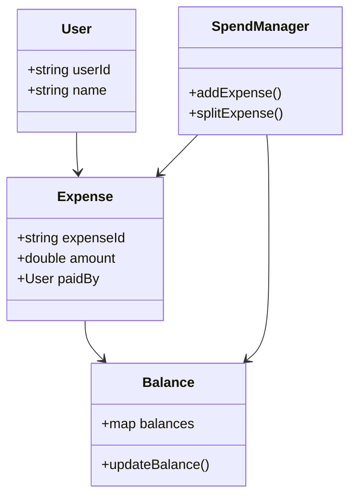
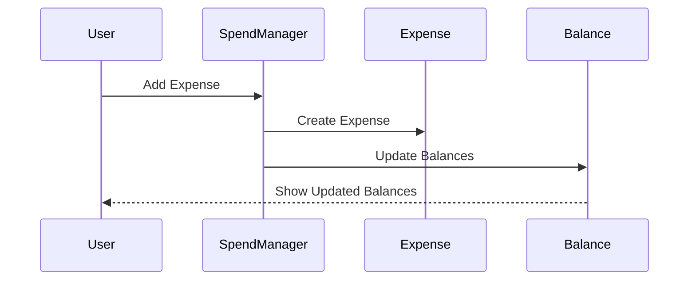

<div align="center">

# 💸 Splitwise Clone  
### C++ Low-Level System Design | Expense Sharing Engine  


*A scalable expense-sharing system built with strong focus on business logic, object-oriented design, and low-level system architecture.*

</div>

---

## ⚡ Overview

This project is a console-based Splitwise Clone built in C++, designed to simulate real-world expense-sharing systems.

It focuses on:
- Core financial business logic  
- Low-Level System Design (LLD)  
- Clean and modular architecture  

---

## 🚀 Features

### 👥 User Management
- Add and manage multiple users  

### 💰 Expense Splitting
- Equal split  
- Exact split  
- Percentage-based split  

### 📊 Balance Tracking
- Tracks who owes whom  
- Maintains individual balance sheets  

### 🔄 Debt Simplification
- Minimizes number of transactions  

### 📁 Transaction Handling
- Efficient expense recording and updates  

---

## 🧠 System Design (LLD)

### 🔹 Core Components
- User → Represents a participant  
- Expense → Handles expense details  
- Balance → Maintains debt relationships  
- SpendManager → Core business logic controller  

### 🔹 Design Principles
- Encapsulation  
- Abstraction  
- Modularity  
- Separation of Concerns  

---

## 🏗️ System Architecture



---

## 🔄 Expense Flow



---

## 📂 Project Structure

```
SplitWise/
│
├── models/
│   ├── Expense.cpp
│   ├── Expense.h
│   ├── User.cpp
│   ├── User.h
│
├── services/
│   ├── Balance.cpp
│   ├── Balance.h
│   ├── SpendManager.cpp
│   ├── SpendManager.h
│
├── main.cpp
```

---

## 💻 Tech Stack

- Language: C++  
- Paradigm: Object-Oriented Programming (OOP)  
- Focus: Low-Level System Design + Business Logic  

---

## 🚀 Quickstart

```bash
# Clone the repository
git clone https://github.com/your-username/splitwise-clone.git

# Navigate into project
cd splitwise-clone

# Compile
g++ main.cpp models/*.cpp services/*.cpp -o splitwise

# Run
./splitwise
```

---

## 🧪 Example

```
User1 paid ₹1000 for 4 users

Each owes: ₹250

Balances:
User2 owes User1 ₹250
User3 owes User1 ₹250
User4 owes User1 ₹250
```

---

## 🎯 Key Highlights

- Built using Low-Level System Design principles  
- Clean separation of models and services layers  
- Strong OOP implementation in C++  
- Simulates real-world financial transaction systems  
- Scalable and maintainable architecture  

---

## 🏁 Future Enhancements

- Database integration (MySQL / MongoDB)  
- REST API backend  
- Web-based UI  
- Authentication system  
- Group-based expense tracking  
- Advanced debt minimization algorithms  

---

## 📄 License

This project is licensed under the MIT License.
